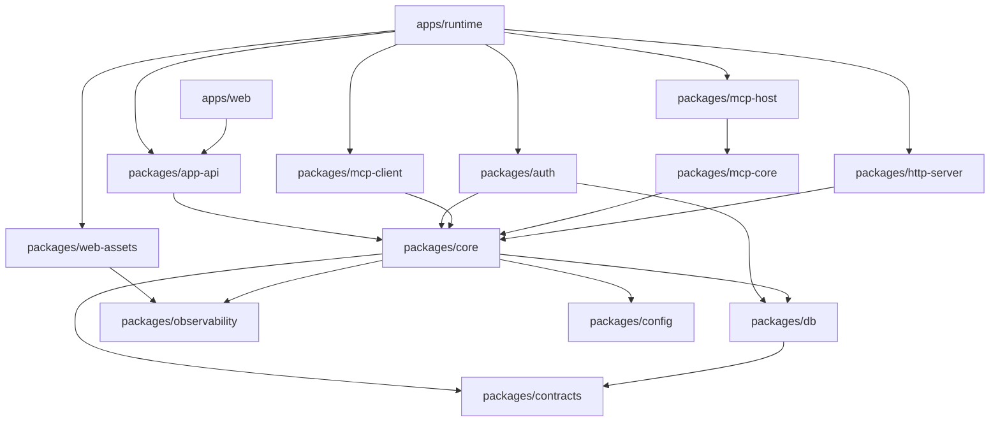

# Prismhub Architecture

Prismhub is structured as a **Turborepo** monorepo using **Bun**. It acts as a local-first companion app and MCP gateway for coding tools.

## High-Level Overview

Prismhub runs as a local background daemon providing:

1. **Dashboard:** A web UI to manage tools, servers, and settings.
2. **MCP Gateway:** Acts as both an MCP client (connecting to upstream MCP servers) and an MCP host (exposing aggregated tools and resources to AI clients like Claude Code or Cursor).
3. **Internal APIs:** To serve the dashboard and command-line interfaces.

## Layer Boundaries and Dependency Graph

The project enforces a strict dependency graph to avoid circular dependencies and ensure a clean architecture.

## Directory Structure

### Apps

- **`apps/runtime`**: The entry point for the CLI (`prismhub`) and the daemon lifecycle. It composes all the internal services, binds the HTTP server, and mounts the MCP host.
- **`apps/web`**: A React + Vite single-page application that serves as the visual dashboard (served at `/dashboard` by the runtime).
  - `src/components/ui/` — shared UI primitives (Button, Input, Modal, etc.)
  - `src/features/mcps/` — MCP dashboard feature UI components
  - `src/pages/live/` — live-feed page-private helpers
  - `src/pages/local-mcp-server/` — local MCP server page-private helpers
  - `src/test-utils/` — MSW handlers and test helpers

### Packages

- **`packages/config`**: Configuration parsing, environment variables (`.env`), and default filesystem paths (e.g., `~/.prismhub`).
- **`packages/contracts`**: Shared TypeBox schemas, TypeScript types, and DTOs that are shared between the frontend (web), API, and core.
- **`packages/core`**: Domain logic (sessions, settings, events, MCP server registry). Each domain is a subdirectory with a normalized `service.ts` entrypoint (e.g. `src/sessions/service.ts`). This layer orchestrates business rules.
- **`packages/db`**: Database layer using Kysely and `bun:sqlite`. Contains schema definitions, migrations, and repository implementations.
- **`packages/http-server`**: Elysia-based HTTP server setup. Provides health/readiness endpoints and generic middleware.
- **`packages/app-api`**: Elysia routes for the private dashboard API (served under `/api/app`).
- **`packages/mcp-client`**: Manages the connection pool to upstream MCP servers (e.g., via `stdio` transport).
- **`packages/mcp-core`**: Core Model Context Protocol implementation, mapping out tool registries and MCP capabilities.
- **`packages/mcp-host`**: Streaming HTTP MCP host interface that exposes Prismhub's aggregated tools to external clients.
- **`packages/observability`**: Structured logging (Pino) and telemetry.
- **`packages/web-assets`**: Script to package the built Vite dashboard into an asset manifest for embedding in a single binary.
- **`packages/testkit` & `packages/testkit-base`**: Shared test helpers (temporary directories, test databases, service factories).
- **`packages/auth`**: Authentication components using Better Auth.

### Scripts

Root-level scripts under `scripts/` orchestrate repo-wide checks and housekeeping:

- `scripts/checks/` — check-runner gates (coverage, test-policy, web-assets-failfast)
- `scripts/_lib/config-checks/` — configuration invariant checks (tsconfig, eslint-config, turbo-cache)

## Technology Stack

- **Runtime:** Bun
- **Database:** SQLite (via `bun:sqlite`), Kysely (Query Builder)
- **Web Server / API:** ElysiaJS
- **Frontend:** React, Vite, Tailwind CSS
- **Validation:** TypeBox
- **Monorepo Tooling:** Turborepo, ESLint, Prettier
